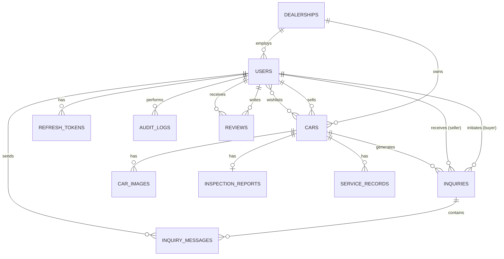

# Database Optimization Strategy

This document outlines the database strategy for PostgreSQL assuming 100,000 vehicles, 50,000 users, and 1 million inquiries.

## 1. Updated Entity Relationship Diagram (ERD)

## 2. Index Strategy (B-Tree & Foreign Keys)

For 100k cars and 1M inquiries, full-table scans will degrade performance. Every Foreign Key must be indexed.

**Mandatory FK Indexes:**
- `CREATE INDEX idx_cars_seller_id ON cars(seller_id);`
- `CREATE INDEX idx_cars_dealership_id ON cars(dealership_id);`
- `CREATE INDEX idx_inquiries_car_id ON inquiries(car_id);`
- `CREATE INDEX idx_inquiries_buyer_id ON inquiries(buyer_id);`
- `CREATE INDEX idx_inquiries_seller_id ON inquiries(seller_id);`
- `CREATE INDEX idx_inquiry_messages_inquiry_id ON inquiry_messages(inquiry_id);`

## 3. Composite & Partial Indexes for Search

The primary read operation is users browsing active cars with multiple filters.

**Partial Indexes for Active Inventory:**
Since users only search `active` cars, partial indexes save memory and speed up queries.
- `CREATE INDEX idx_cars_make_model_active ON cars(make, model) WHERE status = 'active' AND deleted_at IS NULL;`
- `CREATE INDEX idx_cars_price_active ON cars(asking_price) WHERE status = 'active' AND deleted_at IS NULL;`

**Composite Indexes:**
For common filter combinations:
- **Location & Price**: `CREATE INDEX idx_cars_city_price ON cars(city, asking_price);`
- **Dealer Dashboard**: Dealers will filter their own inquiries: `CREATE INDEX idx_inquiries_seller_status ON inquiries(seller_id, status);`
- **Audit Logs**: Querying logs by entity: `CREATE INDEX idx_audit_logs_entity ON audit_logs(entity_type, entity_id);`

**JSONB Indexing:**
If we allow searching within `highlights` or `findings` in inspection reports:
- `CREATE INDEX idx_cars_highlights_gin ON cars USING GIN (highlights);`

## 4. Query Optimization Recommendations

1. **Keyset Pagination (Cursor-based) over OFFSET/LIMIT**
   - **Problem**: `OFFSET 50000 LIMIT 20` on a 100k car table requires the DB to scan and discard 50,000 rows.
   - **Solution**: Use cursor-based pagination using the `id` or `created_at`. (`WHERE created_at < cursor LIMIT 20`).

2. **Mitigating N+1 Query Problems**
   - **Problem**: Querying 20 cars, and then SQLAlchemy lazy-loads `car_images` for each car resulting in 21 queries.
   - **Solution**: Use SQLAlchemy's `joinedload` or `selectinload` for relationships. `selectinload` is highly recommended for 1-to-many collections like `images` or `service_records`.

3. **Soft Delete Handling**
   - Adding `deleted_at IS NULL` to every query overheads the planner. 
   - Ensure soft deletes are handled at the base repository level or use SQLAlchemy events. Keep partial indexes filtered by `deleted_at IS NULL`.

4. **Connection Pooling**
   - With 50,000 users, traffic spikes are likely. 
   - **Solution**: Use `PgBouncer` to manage connection pooling at the infrastructure level, combined with SQLAlchemy's `NullPool` or bounded `QueuePool`.

5. **Caching Aggregates**
   - **Problem**: Calculating `review_count` or `rating` dynamically per user on read.
   - **Solution**: Triggers or application-level events to maintain denormalized counter columns on the `users` table (`review_count`, `average_rating`).
