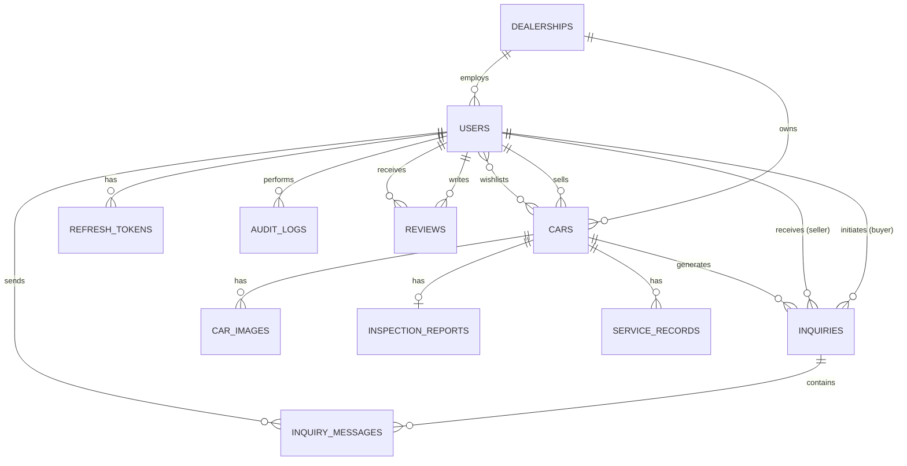

# TrustedCars Backend Architecture Design

This document details the production-ready backend architecture for the TrustedCars marketplace.

## 1. Business Domains

Based on the frontend requirements, the system is divided into four primary business domains:

1. **Identity & Access Management (IAM):** Users, Roles (Admin, Standard User), Authentication (JWT), and Profile Management.
2. **Inventory Management:** Core vehicle catalog, multimedia (images), search & filtering logic, and active/pending status lifecycles.
3. **Quality & Trust:** Inspection reports, service histories, quality badges, and enterprise promises.
4. **Marketplace Interactions:** Buyer-seller communications (Inquiries, Messages), Reviews, and Wishlists.

## 2. Database Schema

We will use PostgreSQL with SQLAlchemy ORM. The primary tables include:

- **`dealerships`**: `id` (UUID), `name`, `registration_number`, `address`, `city`, `state`, `contact_phone`, `created_at`, `deleted_at` (Soft Delete).
- **`users`**: `id` (UUID), `dealership_id` (FK, nullable), `email`, `hashed_password`, `full_name`, `phone`, `role` (user, dealer, admin), `avatar_url`, `is_verified`, `city`, `state`, `rating`, `review_count`, `created_at`, `deleted_at` (Soft Delete).
- **`refresh_tokens`**: `id` (UUID), `user_id` (FK), `token` (hashed), `expires_at`, `revoked_at`, `created_at`, `ip_address`, `user_agent`.
- **`cars`**: `id` (UUID), `seller_id` (FK), `dealership_id` (FK, nullable), `make`, `model`, `variant`, `year`, `fuel_type`, `transmission`, `body_type`, `engine_cc`, `mileage_kmpl`, `odometer_km`, `ownership_count`, `asking_price`, `market_value`, `price_negotiable`, `city`, `state`, `description`, `highlights` (JSONB), `quality_badge`, `status` (pending, active, sold, rejected), `is_featured`, `view_count`, `wishlist_count`, `created_at`, `deleted_at` (Soft Delete).
- **`car_images`**: `id`, `car_id` (FK), `url`, `is_primary`, `sort_order`.
- **`inspection_reports`**: `id`, `car_id` (FK), `inspector_name`, `overall_score`, `findings` (JSONB), `inspected_at`.
- **`service_records`**: `id`, `car_id` (FK), `service_date`, `odometer_at_service`, `service_center`, `service_type`.
- **`inquiries`**: `id`, `car_id` (FK), `buyer_id` (FK), `seller_id` (FK), `status` (open, closed), `initial_message`, `created_at`, `deleted_at` (Soft Delete).
- **`inquiry_messages`**: `id`, `inquiry_id` (FK), `sender_id` (FK), `message`, `created_at`, `deleted_at` (Soft Delete).
- **`reviews`**: `id`, `reviewer_id` (FK), `seller_id` (FK), `car_id` (FK, Optional), `rating`, `comment`, `created_at`, `deleted_at` (Soft Delete).
- **`wishlists`**: Join table (`user_id`, `car_id`, `created_at`).
- **`audit_logs`**: `id` (UUID), `user_id` (FK, nullable), `action` (VARCHAR), `entity_type` (VARCHAR), `entity_id` (UUID), `changes` (JSONB), `ip_address`, `created_at`.

## 3. Entity Relationships



## 4. API Endpoints

RESTful principles following standard resource hierarchies.

**Auth & Users**
- `POST /api/v1/auth/register`
- `POST /api/v1/auth/login` (Returns JWT token)
- `GET /api/v1/users/me`
- `PUT /api/v1/users/me`

**Inventory (Cars)**
- `GET /api/v1/cars` (Public, with pagination & extensive filtering)
- `GET /api/v1/cars/{id}`
- `POST /api/v1/cars` (Protected)
- `PUT /api/v1/cars/{id}` (Protected: Owner or Admin)
- `POST /api/v1/cars/{id}/images` (Protected)

**Admin Operations**
- `GET /api/v1/admin/cars` (View pending/rejected cars)
- `PATCH /api/v1/admin/cars/{id}/status` (Approve/Reject)
- `POST /api/v1/admin/cars/{id}/inspection`
- `GET /api/v1/admin/users`

**Interactions**
- `POST /api/v1/inquiries` (Protected)
- `GET /api/v1/inquiries` (Protected: Returns inquiries for current user)
- `POST /api/v1/inquiries/{id}/messages` (Protected)
- `POST /api/v1/wishlists/{car_id}` (Protected)
- `DELETE /api/v1/wishlists/{car_id}` (Protected)

## 5. User Roles

1. **Standard User (`user`)**: Can browse cars, register, log in, add cars to their wishlist, post cars for sale (starts in `pending` status), and message sellers.
2. **Dealer (`dealer`)**: Can manage dealership profile, create listings, manage inventory, respond to inquiries, access dealer dashboard, and view dealership analytics.
3. **Administrator (`admin`)**: Can perform all user actions, view system-wide statistics, change car statuses (approve/reject), manage inspection reports, and ban users. 

## 6. Authentication Flow

1. **Client** sends credentials to `POST /api/v1/auth/login`.
2. **Backend** validates credentials against the hashed password in PostgreSQL using `passlib` (bcrypt).
3. **Backend** generates an access JWT (expires in e.g., 30 mins) and a refresh token.
4. **Client** stores tokens securely and attaches the access token in the `Authorization: Bearer <token>` header for subsequent requests.

## 7. Authorization Flow

FastAPI relies on Dependencies for authorization:
1. `get_current_user`: Decodes JWT, validates signature and expiration, retrieves the `User` object, or raises `401 Unauthorized`.
2. `get_current_active_user`: Depends on `get_current_user`, ensures `is_verified` and not banned.
3. `get_current_admin`: Depends on `get_current_active_user`, checks `user.role == 'admin'`, or raises `403 Forbidden`.
4. **Resource-level Auth**: For operations like `PUT /cars/{id}`, the backend fetches the car and asserts `car.seller_id == current_user.id` OR `current_user.role == 'admin'`.

## 8. Folder Structure

We use a modular, domain-driven module structure that scales much better for production projects in 2026.

```text
backend/
├── alembic/                     # Database migrations
├── tests/                       # Pytest suite
├── docker-compose.yml           # Local dev services (Postgres, Redis)
├── Dockerfile                   # Prod image definition
├── requirements.txt
└── app/
    ├── main.py                  # FastAPI app initialization
    ├── core/                    # Configuration, security, settings
    ├── db/                      # Session maker, base class, migrations config
    ├── modules/                 # Domain-specific modules
    │   ├── auth/
    │   │   ├── models.py
    │   │   ├── schemas.py
    │   │   ├── repository.py
    │   │   ├── service.py
    │   │   └── router.py
    │   ├── users/
    │   ├── cars/
    │   ├── inquiries/
    │   ├── reviews/
    │   ├── wishlist/
    │   └── dealerships/
    └── shared/                  # Cross-domain utilities
        ├── exceptions/
        ├── middleware/
        ├── utils/
        └── dependencies/
```

## 9. File Structure (Key Files)

- `app/main.py`: Bootstraps FastAPI, configures CORS, and mounts module routers.
- `app/core/config.py`: Loads `.env` using Pydantic `BaseSettings`.
- `app/shared/dependencies/auth.py`: Contains `get_current_user()` and role-based dependencies.
- `app/db/base.py`: The declarative base for SQLAlchemy.
- `app/modules/cars/schemas.py`: Pydantic models like `CarCreate`, `CarResponse`.
- `app/modules/cars/service.py`: Business logic for car inventory.
- `app/modules/cars/repository.py`: SQLAlchemy database interactions for the `cars` domain.

## 10. Backend Roadmap

**Phase 1: Foundation (Week 1)**
- Docker & PostgreSQL setup.
- SQLAlchemy & Alembic configuration.
- Core Identity (User model, schemas, CRUD).
- Auth system (JWT generation, dependencies).

**Phase 2: Core Inventory (Week 2)**
- Car and CarImage models.
- Endpoints for creating and retrieving cars (with robust filtering).
- S3/Cloud storage integration for images.

**Phase 3: Interactions & Transactions (Week 3)**
- Inquiries and messaging models/endpoints.
- Wishlist functionality.
- Review system.

**Phase 4: Admin & Trust Layer (Week 4)**
- Inspection Reports and Service Records.
- Admin dashboard endpoints (metrics, pending approvals).
- Status lifecycle management.

**Phase 5: Production Polish (Week 5)**
- Pytest coverage > 80%.
- Rate limiting, Redis caching for heavy queries (e.g., featured cars).
- CI/CD pipeline setup (GitHub Actions).
- Deployment orchestration.

---

> [!IMPORTANT]
> **User Review Required**: Please review the proposed architecture, database schema, and roadmap. Let me know if you would like any modifications before we consider the planning phase complete.
